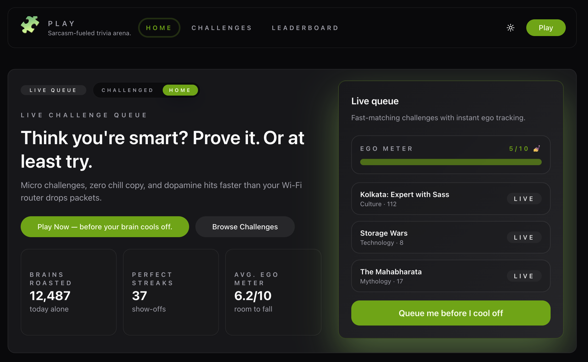

# Play

Play is a monorepo that powers the Play Dodon quiz experience, pairing a Vite/React frontend with an Express/Prisma backend that is backed by PostgreSQL and curated quiz data.

## Screenshot


## Table of contents
- [Play](#play)
  - [Screenshot](#screenshot)
  - [Table of contents](#table-of-contents)
  - [Overview](#overview)
  - [Architecture](#architecture)
  - [Getting started](#getting-started)
  - [Running the apps](#running-the-apps)
  - [API snapshot](#api-snapshot)
  - [Admin tooling](#admin-tooling)
  - [Screenshots](#screenshots)
  - [License](#license)

## Overview
The frontend is a modern React+Vite SPA that calls the backend API to render featured challenges, roll up leaderboard data, and keep the experience responsive with Tailwind/TanStack utilities. The backend exposes a set of quiz and leaderboard endpoints, seeds data via Prisma, and ships Swagger docs for quick exploration.

## Architecture
- **Frontend:** Vite + React + TailwindCSS handles routing, theming, and responsive layout.
- **Backend:** Express server with CORS protection, `swagger-jsdoc` + `swagger-ui-express`, and Prisma for data and schema migrations.
- **Persistence:** PostgreSQL (connection string lives in `.env`) with Prisma migrations (`npx prisma migrate`) and seed helpers.

## Getting started
1. Install dependencies from the monorepo root:
   ```bash
   npm install
   ```
2. Copy the root `.env` (already tracked) and adjust any secrets/hostnames for your environment.
3. Make sure your PostgreSQL instance is reachable and `DATABASE_URL` points to a writable database.
4. If you need fresh data, run Prisma commands from `apps/backend` (e.g., `npm --workspace apps/backend run migrate:deploy`).

## Running the apps
- Start the backend server and watch files:
  ```bash
  npm run dev:backend
  ```
  The server listens on `http://localhost:6008/api` by default.
- Start the frontend dev server at the same time:
  ```bash
  npm run dev:frontend
  ```
  Vite will serve the UI on `http://localhost:6009` and proxy API requests to the backend.

## API snapshot
- `GET /api/health` – health check.
- `GET /api/quizzes` – paginated quiz catalog with optional `featured`, `category`, and `limit` filters.
- `GET /api/quizzes/:slug/leaderboard` – top 10 leaderboard for a quiz.
- `POST /api/quizzes/:slug/leaderboard` – submit a leaderboard entry (requires username, score, completion time).
- `GET /api/leaderboard` – aggregate leaderboard across users with pagination, category, challenge, and period filters.
- `POST /api/admin/quizzes/upload` – upload the Excel workbook (see admin tooling) and seed quiz/question data.
- Swagger docs live at `http://localhost:6008/api/docs` for complete schema/response details.

## Admin tooling
The backend ships with Excel-driven import helpers:
1. Download the template via `GET /api/admin/quiz-template` (protected by `ADMIN_PASSWORD`).
2. Fill out the **Quiz** and **Questions** sheets (required headers are enforced).
3. POST the workbook to `/api/admin/quizzes/upload` with the `x-admin-password` header or `password` body field. Use `force` to overwrite existing slugs.

A standalone script (`apps/backend/scripts/importQuizFromExcel.js`) also reuses the same import logic if you prefer CLI-driven seeds.

## Screenshots


## License
This project is released under the [MIT License](LICENSE).
